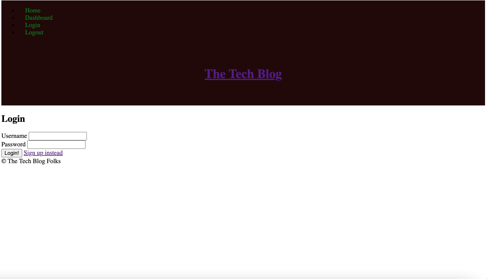
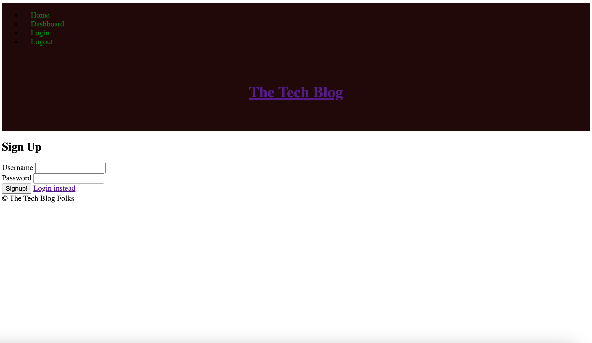
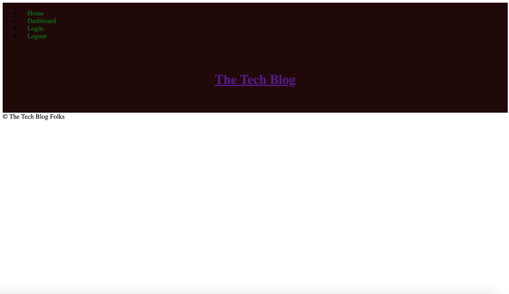

# Tech Blog

## Description
This application is designed to allow multiple users to post multiple blog posts about the tech world. They can add comments underneath posts and create new posts for others to see. Users can access their own posts by going to their dashboard. The users can see when posts were created, and they can edit old posts. This application is very useful for the technology community because they can use this to see information about certain things. The application can be used by going to the deployment link. Unfortunately, I was unable to deploy the application onto heroku, so it doesn't work. 

## Screenshots 

